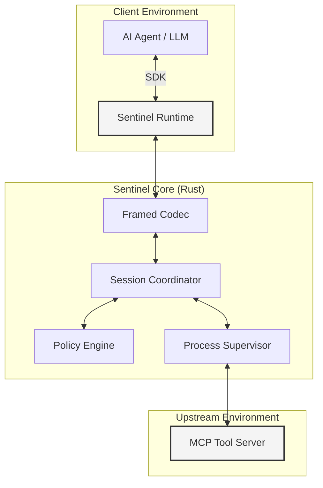

# Sentinel

**Deterministic Security Middleware for MCP tool calls written in Rust.**

[](https://github.com/peti12352/sentinel/actions)
[](LICENSE)
[](https://github.com/peti12352/sentinel/releases)

Sentinel is a high-performance security runtime designed to mitigate data exfiltration and unauthorized tool invocation in LLM-based agent systems. By interposing at the transport layer, Sentinel enforces security invariants through deterministic policy evaluation and strictly framed execution.

Sentinel is OS, framework, and language agnostic, providing uniform security primitives across diverse implementation environments.

---

## Technical Fundamentals

- **Security Priority**: Sentinel adheres to a hierarchy of constraints where security correctness precedes performance and feature parity.
- **Fail-Closed Architecture**: The system defaults to a `DENY` state. If a policy is missing, corrupted, or if an internal evaluation error occurs, all traffic is blocked.
- **Zero-Trust Transport**: Stdio and network payloads are treated as potentially malicious. Sentinel enforces strictly framed `Content-Length` headers to prevent JSON smuggling and synchronization attacks.
- **Type-Safe Invariants**: Core security logic leverages the Rust type system to make invalid security states (e.g., unverified taint propagation) unrepresentable at compile time.

---

## Core Capabilities

| Capability | Technical Implementation |
| :--- | :--- |
| **Deterministic ACLs** | Static allow/deny mapping for tool execution and resource identifiers. |
| **Dynamic Taint Tracking** | Information flow control using session-bound sensitivity tags (e.g., `CONFIDENTIAL`). |
| **Lethal Trifecta Protection** | Automatic blocking of the "Access Private -> Access Untrusted -> Exfiltrate" pattern. |
| **Tamper-Proof Audit Logs** | Cryptographically signed (HMAC-SHA256) execution logs for non-repudiation. |
| **Logic-Based Policies** | Argument-level enforcement using recursive logical predicates (e.g., region constraints). |
| **Zero-Copy Runtime** | Low-latency processing (<1ms overhead) via reference-based internal message passing. |
| **Process Supervision** | OS-level lifecycle management for upstream processes to prevent resource leakage. |
| **Transport Hardening** | Strict content-length framing to prevent JSON-RPC smuggling and desynchronization. |

---

## System Architecture

Sentinel functions as a standalone security boundary between the Agent (client) and the Tool Server (upstream).



### Component Specification
- **Session Coordinator**: An asynchronous actor based on the Tokio runtime, responsible for session state management and HMAC-signed token verification.
- **Hardened Codec**: A framing layer implementing LSP-style headers to ensure unambiguous message boundaries across stdio streams.
- **Policy Engine**: A deterministic evaluator that processes serialized policy definitions without the non-determinism of probabilistic models.

---

## Implementation

### 1. Installation & Auto-Discovery
The Python SDK handles the entire lifecycle. It automatically downloads the correct `sentinel` binary for your OS/Arch (Windows, Linux, macOS) from GitHub Releases if not found locally.

```bash
uv add sentinel-sdk
# or
pip install sentinel-sdk
```

No manual binary compilation is required. The SDK ensures strict hermetic execution.

### 2. Policy Configuration (`policy.yaml`)
Security boundaries are defined in a structured YAML schema.

#### Lethal Trifecta Protection
The "Lethal Trifecta" (Access Private Data + Access Untrusted Source + Exfiltration) is the most critical agentic risk. Sentinel can block this pattern **automatically**, without complex rule definitions.

**Option A: Global Enforcement (Ops / CI)**
Set `SENTINEL_FORCE_LETHAL_TRIFECTA=true` in your environment. This overrides local policies and enforces protection globally.

**Option B: Policy-Level (Dev)**
```yaml
protect_lethal_trifecta: true  # Enable automatic exfiltration blocking

resourceRules:
  - uriPattern: "file:///private/*"
    action: ALLOW
    taintsToAdd: [ACCESS_PRIVATE]
  - uriPattern: "http*"
    action: ALLOW
    taintsToAdd: [UNTRUSTED_SOURCE]

taintRules:
  - tool: curl
    action: ADD_TAINT
    tag: UNTRUSTED_SOURCE

# ... existing rules ...
```

When enabled, if a session acquires both `ACCESS_PRIVATE` and `UNTRUSTED_SOURCE` taints, any tool classified as `EXFILTRATION` (or performing network writes) is **automatically blocked**.

### 3. Agent Integration
Sentinel integrates with standard agent architectures by wrapping the tool server invocation.

```python
from sentinel_sdk import Sentinel, PolicyViolationError

async def main():
    # Automatic binary discovery and process management
    async with Sentinel("python tools.py", policy="policy.yaml") as sentinel:
        try:
            # Authorized call
            await sentinel.call_tool("calculator", {"expression": "2+2"})
            
            # Blocked by Taint Tracking
            data = await sentinel.call_tool("read_customer_data", {"id": "123"})
            await sentinel.call_tool("export_analytics", {"data": data})
            
        except PolicyViolationError as e:
            # Handle security interception
            print(f"Policy Violation: {e}")

if __name__ == "__main__":
    import asyncio
    asyncio.run(main())
```

### 4. Observability & Auditing
Sentinel emits **cryptographically signed** audit logs to `stderr` (visible in agent logs).

**Format**: `[AUDIT] <HMAC-SHA256 Signature> <JSON Payload>`

**Example**:
```log
[AUDIT] 8f3...a1b {"session_id": "uuid", "event": "Decision", "decision": "DENY", "details": {...}}
```
This ensures non-repudiation. Even if the log file is tampered with, the signature will fail verification against the session's ephemeral secret (or a configured shared secret).

### 5. Examples
Full integration examples are available in the `examples/` directory:
- **[LangChain Agent](examples/langchain_agent)**: Complete ReAct agent demonstrating static rules, taint tracking, and logic exceptions.
- **[ReAct Agent](examples/react_agent_demo)**: Minimalist demonstration of security middleware.

---

## Development and Verification

### Build Requirements
- **Rust Toolchain**: 1.75+ (Stable)
- **Python Runtime**: 3.10+
- **Build System**: Cargo (Rust) and uv (Python)

### Performance Benchmarks
Sentinel is optimized for minimal latency impact:
- **Handshake Latency**: <5ms
- **Request Processing**: <0.8ms
- **Memory Overhead**: <15MB (RSS)

---

## License

Sentinel is released under the **Apache License, Version 2.0**. Refer to the [LICENSE](LICENSE) file for the full text.
