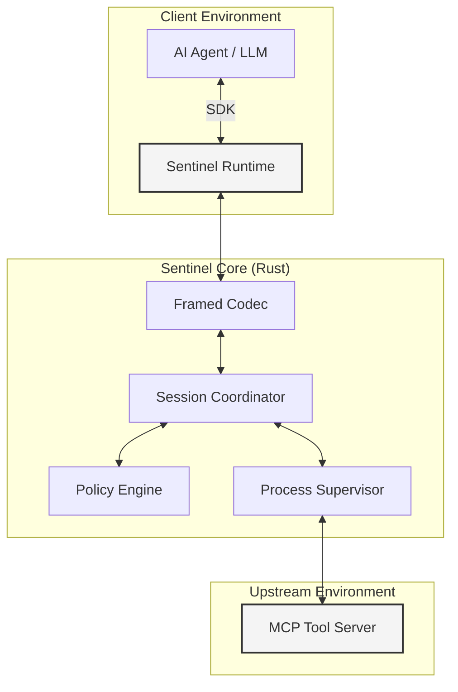

# Sentinel

**Deterministic Security Middleware for MCP tool calls written in Rust.**

[](https://github.com/peti12352/sentinel/actions)
[](LICENSE)
[](https://github.com/peti12352/sentinel/releases)

Sentinel is a high-performance security runtime designed to mitigate data exfiltration and unauthorized tool invocation in LLM-based agent systems. By interposing at the transport layer, Sentinel enforces security invariants through deterministic policy evaluation and strictly framed execution.

It's OS/framework/lang agnostic and 

---

## Technical Fundamentals

- **Security Priority**: Sentinel adheres to a hierarchy of constraints where security correctness precedes performance and feature parity.
- **Fail-Closed Architecture**: The system defaults to a `DENY` state. If a policy is missing, corrupted, or if an internal evaluation error occurs, all traffic is blocked.
- **Zero-Trust Transport**: Stdio and network payloads are treated as potentially malicious. Sentinel enforces strictly framed `Content-Length` headers to prevent JSON smuggling and synchronization attacks.
- **Type-Safe Invariants**: Core security logic leverages the Rust type system to make invalid security states (e.g., unverified taint propagation) unrepresentable at compile time.

---

## Core Capabilities

| Capability | Technical Implementation |
| :--- | :--- |
| **Deterministic ACLs** | Static allow/deny mapping for tool execution and resource identifiers. |
| **Dynamic Taint Tracking** | Information flow control using session-bound sensitivity tags (e.g., `CONFIDENTIAL`). |
| **Conditional Logic** | Argument-level enforcement using logical predicates (e.g., geographic region constraints). |
| **Zero-Copy Runtime** | Low-latency processing (<1ms overhead) via reference-based internal message passing. |
| **Transport Hardening** | Randomized spotlighting delimiters suppress prompt injection by encapsulating tool outputs. |
| **Process Supervision** | OS-level lifecycle management for upstream processes to prevent resource leakage. |

---

## System Architecture

Sentinel functions as a standalone security boundary between the Agent (client) and the Tool Server (upstream).



### Component Specification
- **Session Coordinator**: An asynchronous actor based on the Tokio runtime, responsible for session state management and HMAC-signed token verification.
- **Hardened Codec**: A framing layer implementing LSP-style headers to ensure unambiguous message boundaries across stdio streams.
- **Policy Engine**: A deterministic evaluator that processes serialized policy definitions without the non-determinism of probabilistic models.

---

## Implementation

### 1. SDK Integration
The Python SDK automates the core runtime lifecycle and manages the underlying binary execution.

```bash
# Install the SDK
uv add sentinel-sdk
```

### 2. Policy Configuration (`policy.yaml`)
Security boundaries are defined in a structured YAML schema.

```yaml
staticRules:
  calculator: ALLOW
  shell_exec: DENY

taintRules:
  - tool: read_customer_data
    action: ADD_TAINT
    tag: pii
  - tool: export_analytics
    action: CHECK_TAINT
    forbiddenTags: [pii]

logicRules:
  - tool: system_maintenance
    allow_if: 
      region: "eu-west-1"
```

### 3. Agent Integration
Sentinel integrates with standard agent architectures by wrapping the tool server invocation.

```python
from sentinel_sdk import Sentinel, PolicyViolationError

async def main():
    # Automatic binary discovery and process management
    async with Sentinel("python tools.py", policy="policy.yaml") as sentinel:
        try:
            # Authorized call
            await sentinel.call_tool("calculator", {"expression": "2+2"})
            
            # Blocked by Taint Tracking
            data = await sentinel.call_tool("read_customer_data", {"id": "123"})
            await sentinel.call_tool("export_analytics", {"data": data})
            
        except PolicyViolationError as e:
            # Handle security interception
            print(f"Policy Violation: {e}")

if __name__ == "__main__":
    import asyncio
    asyncio.run(main())
```

---

## Development and Verification

### Build Requirements
- **Rust Toolchain**: 1.75+ (Stable)
- **Python Runtime**: 3.10+
- **Build System**: Cargo (Rust) and uv (Python)

### Performance Benchmarks
Sentinel is optimized for minimal latency impact:
- **Handshake Latency**: <5ms
- **Request Processing**: <0.8ms
- **Memory Overhead**: <15MB (RSS)

---

## License

Sentinel is released under the **Apache License, Version 2.0**. Refer to the [LICENSE](LICENSE) file for the full text.
