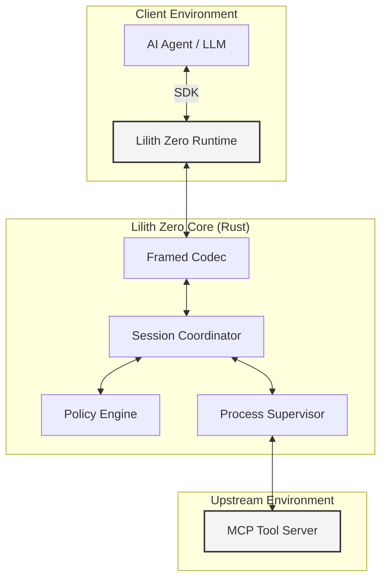

<div align="center">

# Lilith-Zero

**Deterministic Security Middleware for MCP tool calls written in Rust.**

<br/>

[](https://github.com/BadC-mpany/lilith-zero/actions)
[](LICENSE)
[](https://github.com/BadC-mpany/lilith-zero/releases)

<br/>


<br/>


</div>

Lilith Zero is a high-performance security runtime designed to mitigate data exfiltration and unauthorized tool invocation in LLM-based agent systems. By interposing at the transport layer, Lilith Zero enforces security invariants through deterministic policy evaluation and strictly framed execution.

Lilith Zero is OS, framework, and language agnostic, providing uniform security primitives across diverse implementation environments.

---

## Technical Fundamentals

- **Security Priority**: Lilith Zero adheres to a hierarchy of constraints where security correctness precedes performance and feature parity.
- **Fail-Closed Architecture**: The system defaults to a `DENY` state. If a policy is missing, corrupted, or if an internal evaluation error occurs, all traffic is blocked.
- **Zero-Trust Transport**: Stdio and network payloads are treated as potentially malicious. Lilith Zero enforces strictly framed `Content-Length` headers to prevent JSON smuggling and synchronization attacks.
- **Type-Safe Invariants**: Core security logic leverages the Rust type system to make invalid security states (e.g., unverified taint propagation) unrepresentable at compile time.

---

## Core Capabilities

| Capability | Technical Implementation |
| :--- | :--- |
| **Deterministic ACLs** | Static allow/deny mapping for tool execution and resource identifiers. |
| **Dynamic Taint Tracking** | Information flow control using session-bound sensitivity tags (e.g., `CONFIDENTIAL`). |
| **Lethal Trifecta Protection** | Automatic blocking of the "Access Private -> Access Untrusted -> Exfiltrate" pattern. |
| **Tamper-Proof Audit Logs** | Cryptographically signed (HMAC-SHA256) execution logs for non-repudiation. |
| **Logic-Based Policies** | Argument-level enforcement using recursive logical predicates (e.g., region constraints). |
| **Zero-Copy Runtime** | Low-latency processing (<1ms overhead) via reference-based internal message passing. |
| **Process Supervision** | OS-level lifecycle management for upstream processes to prevent resource leakage. |
| **Transport Hardening** | Strict content-length framing to prevent JSON-RPC smuggling and desynchronization. |

---

## System Architecture

Lilith Zero functions as a standalone security boundary between the Agent (client) and the Tool Server (upstream).


```mermaid
graph TD
    subgraph "Client Environment"
        A[AI Agent / LLM] <-->|SDK| B[Lilith Zero Runtime]
    end

    subgraph "Lilith Zero Core (Rust)"
        B <--> Codec[Framed Codec]
        Codec <--> Coordinator[Session Coordinator]
        Coordinator <--> Policy[Policy Engine]
        Coordinator <--> Supervisor[Process Supervisor]
    end

    subgraph "Upstream Environment"
        Supervisor <--> Tool[MCP Tool Server]
    end

    style B fill:#f4f4f4,stroke:#333,stroke-width:2px
    style Tool fill:#f4f4f4,stroke:#333,stroke-width:2px
```

### Component Specification
- **Session Coordinator**: An asynchronous actor based on the Tokio runtime, responsible for session state management and HMAC-signed token verification.
- **Hardened Codec**: A framing layer implementing LSP-style headers to ensure unambiguous message boundaries across stdio streams.
- **Policy Engine**: A deterministic evaluator that processes serialized policy definitions without the non-determinism of probabilistic models.

---

## Agent Integrations

Lilith Zero ships purpose-built adapters for each major coding agent platform. All adapters share the same policy engine, taint tracker, and audit layer — only the I/O contract differs.

### Claude Code

Claude Code fires hooks on every tool call. Lilith Zero reads the JSON event from stdin, evaluates it against your policy, and signals the decision via exit code (`0` = allow, `2` = block).

**`~/.claude/settings.json`** (or project `.claude/settings.json`):
```json
{
  "hooks": {
    "PreToolUse": [{
      "matcher": "",
      "hooks": [{"type": "command", "command": "lilith-zero hook --policy /path/to/policy.yaml"}]
    }],
    "PostToolUse": [{
      "matcher": "",
      "hooks": [{"type": "command", "command": "lilith-zero hook --policy /path/to/policy.yaml"}]
    }]
  }
}
```

See `scripts/hooks.json` for a ready-to-use template.

### GitHub Copilot CLI / Cloud Coding Agent

Copilot passes events via stdin and reads a `{"permissionDecision":"allow"|"deny"}` JSON line from stdout. Exit code is always `0`; the decision is communicated through the JSON payload.

**`~/.config/github-copilot/hooks.json`**:
```json
{
  "preToolUse": {"command": "lilith-zero hook --format copilot --event preToolUse --policy /path/to/policy.yaml"},
  "postToolUse": {"command": "lilith-zero hook --format copilot --event postToolUse --policy /path/to/policy.yaml"}
}
```

See `examples/gh-copilot/` for complete policy examples using the real Copilot tool names (`bash`, `view`, `rg`, `glob`, `report_intent`).

### VS Code Copilot Sidebar (Agent Mode)

VS Code agent mode uses a `hookSpecificOutput` wrapper. Event type is inferred from the JSON payload — no `--event` flag required.

**`.vscode/settings.json`** (workspace) or User Settings:
```json
{
  "github.copilot.chat.agent.hooks": {
    "PreToolUse": {"command": "lilith-zero hook --format vscode --policy /path/to/policy.yaml"},
    "PostToolUse": {"command": "lilith-zero hook --format vscode --policy /path/to/policy.yaml"}
  }
}
```

See `examples/vscode/` for complete setup including all built-in VS Code tool names (`editFiles`, `runTerminalCommand`, `#fetch`, `#codebase`, MCP tools).

### Copilot Studio Webhook

For enterprise deployments, Lilith Zero can run as a REST webhook server implementing the Microsoft Copilot Studio External Threat Detection API.

```bash
# Development (no auth)
lilith-zero serve --bind 127.0.0.1:8080 --auth-mode none --policy policy.yaml

# Production with Microsoft Entra ID
lilith-zero serve --bind 0.0.0.0:8443 \
  --auth-mode entra \
  --entra-tenant-id <TENANT_GUID> \
  --entra-audience https://security.contoso.com \
  --policy policy.yaml
```

Endpoints: `POST /validate` (health check), `POST /analyze-tool-execution` (policy evaluation).

### Session Persistence

Hook mode maintains taint state **across invocations** within a session. State is stored in `~/.lilith/sessions/<session-id>.json` with cross-process file locking, so taints accumulated during one tool call are visible to the next — even if the binary is restarted between calls.

---

## Transports

### stdio (default)
Wraps a child MCP server process. Lilith Zero sits between the agent and the server on stdin/stdout.

```bash
lilith-zero run --upstream-cmd "python mcp_server.py" --policy policy.yaml
# or short form (backward compatible):
lilith-zero --upstream-cmd "python mcp_server.py" --policy policy.yaml
```

### Streamable HTTP (MCP 2025-11-25)
Connects to a remote MCP server over Streamable HTTP. No child process is spawned.

```bash
lilith-zero run --transport http --upstream-url http://localhost:9000/mcp --policy policy.yaml
```

---

## SDKs

### Python SDK
```bash
pip install lilith-zero          # auto-downloads the correct binary for your platform
```
```python
from lilith_zero import Lilith

async with Lilith("python mcp_server.py", policy="policy.yaml") as lz:
    result = await lz.call_tool("read_file", {"path": "/data/report.txt"})
```

### TypeScript / Node.js SDK
```bash
npm install @badcompany/lilith-zero
```
```typescript
import { Lilith } from "@badcompany/lilith-zero";

await using lz = new Lilith({ upstream: "node mcp_server.js", policy: "policy.yaml" });
const result = await lz.callTool("read_file", { path: "/data/report.txt" });
```

---

## Implementation

### 1. Installation & Auto-Discovery

**Option A: Python SDK**
The Python SDK handles the entire lifecycle. It automatically downloads the correct `Lilith Zero` binary for your OS/Arch from GitHub Releases.

```bash
pip install lilith-zero
```

**Option B: Shell Installer (Unix/macOS)**
```bash
curl -sSfL https://badcompany.xyz/lilith-zero/install.sh | sh
```

**Option C: PowerShell Installer (Windows)**
```powershell
irm https://badcompany.xyz/lilith-zero/install.ps1 | iex
```

No manual binary compilation is required. The installers ensure strict platform-matching execution.

### 2. Policy Configuration (`policy.yaml`)
Security boundaries are defined in a structured YAML schema.

#### Lethal Trifecta Protection
The "Lethal Trifecta" (Access Private Data + Access Untrusted Source + External Communication) is the most critical agentic risk. Lilith Zero can block this pattern **automatically**, without complex rule definitions.

**Option A: Global Enforcement (Ops / CI)**
Set `LILITH_ZERO_FORCE_LETHAL_TRIFECTA=true` in your environment. This overrides local policies and enforces protection globally.

**Option B: Policy-Level (Dev)**
```yaml
protect_lethal_trifecta: true  # Enable automatic exfiltration blocking

resourceRules:
  - uriPattern: "file:///private/*"
    action: ALLOW
    taintsToAdd: [ACCESS_PRIVATE]
  - uriPattern: "http*"
    action: ALLOW
    taintsToAdd: [UNTRUSTED_SOURCE]

taintRules:
  - tool: curl
    action: ADD_TAINT
    tag: UNTRUSTED_SOURCE

# ... existing rules ...
```

When enabled, if a session acquires both `ACCESS_PRIVATE` and `UNTRUSTED_SOURCE` taints, any tool classified as `EXFILTRATION` or `NETWORK` (e.g., `curl`, `wget`, `requests`) is **automatically blocked**.

### 3. Configuration Reference

Lilith Zero is configured via environment variables and policy files.

| Environment Variable | Description | Default |
| :--- | :--- | :--- |
| `LILITH_ZERO_FORCE_LETHAL_TRIFECTA` | Global override to block all exfiltration attempts. | `false` |
| `LILITH_ZERO_SECURITY_LEVEL` | Security enforcement mode (`audit_only`, `block_params`). | `block_params` |
| `LILITH_ZERO_JWT_SECRET` | Secret key for verifying external audience tokens. | - |
| `LOG_LEVEL` | Logging verbosity (`debug`, `info`, `warn`, `error`). | `info` |

### 4. Agent Integration
Lilith Zero integrates with standard agent architectures by wrapping the tool server invocation.

```python
from lilith_zero import Lilith
from lilith_zero.exceptions import PolicyViolationError

async def main():
    # Automatic binary discovery and process management
    async with Lilith("python tools.py", policy="policy.yaml") as az:
        try:
            # Authorized call
            await az.call_tool("calculator", {"expression": "2+2"})
            
            # Blocked by Taint Tracking
            data = await az.call_tool("read_customer_data", {"id": "123"})
            await az.call_tool("export_analytics", {"data": data})
            
        except PolicyViolationError as e:
            # Handle security interception
            print(f"Policy Violation: {e}")

if __name__ == "__main__":
    import asyncio
    asyncio.run(main())
```

### 5. Observability & Auditing

**Audit Logs**
Lilith Zero emits **cryptographically signed** audit logs to `stderr` (visible in agent logs).

**Format**: `[AUDIT] <HMAC-SHA256 Signature> <JSON Payload>`

**Example**:
```log
[AUDIT] 8f3...a1b {"session_id": "uuid", "event": "Decision", "decision": "DENY", "details": {...}}
```
This ensures non-repudiation. Even if the log file is tampered with, the signature will fail verification against the session's ephemeral secret (or a configured shared secret).

**Telemetry Grouping**
Lilith Zero integrates directly with the `lilith-telemetry` system. When run with a Flock telemetry link (e.g., `--telemetry-link`), it enables cross-process span propagation. This allows all multi-tool interactions originating from a single LLM reasoning step to be accurately traced and grouped into unified, logical context spans within your dashboard.

### 6. IDE & CLI Agent Hooks

Lilith Zero can intercept every tool call made by coding agents directly in your IDE or terminal — no MCP proxy required. Hooks fire before each tool execution and enforce the same policy engine.

| Integration | Hook format | Session scope |
| :--- | :--- | :--- |
| **VS Code Copilot** (agent mode) | `--format vscode` | Per VS Code session — taint persists across chat reloads and restarts |
| **gh copilot CLI** | `--format copilot` | Per CLI invocation — taint persists within a session |
| **Claude Code** | `--format claude` | Per session |

See **[examples/SETUP.md](examples/SETUP.md)** for step-by-step setup and **[examples/vscode/TOOLS.md](examples/vscode/TOOLS.md)** / **[examples/gh-copilot/TOOLS.md](examples/gh-copilot/TOOLS.md)** for the tool name reference.

### 7. Examples
Full integration examples are available in the `examples/` directory:
- **[VS Code Copilot](examples/vscode)**: Agent mode hooks with static and taint-tracking policies.
- **[gh copilot CLI](examples/gh-copilot)**: Terminal agent hooks with lethal-trifecta protection.
- **[LangChain Agent](examples/python/langchain)**: Complete ReAct agent demonstrating static rules, taint tracking, and logic exceptions.

---

## Development and Verification

### Build Requirements

For full setup instructions, see **[docs/development.md](docs/development.md)**.

- **Rust**: Managed via `rustup` (Stable + Nightly for Miri).
- **Python**: Managed via `uv` (3.10+).
- **Supported Platforms**: Linux, Windows, macOS.

### Technical Constraints
- **Max Message Size**: 10 MB (JSON-RPC payloads exceeding this are dropped to prevent DoS).
- **Supported Platforms**: Windows (x64), Linux (x64, ARM64), macOS (ARM64).

## Security & Assurance

Lilith Zero is engineered with **high-assurance rigor**, employing a multi-layered verification strategy to ensure mathematical correctness and runtime invulnerability.

| Assurance Layer | implementation | Status |
| :--- | :--- | :--- |
| **Formal Verification** | **Kani Rust Verifier** proofs for taint sanitization, overflow safety, and session entropy. | **Verified** |
| **Fuzz Testing** | Continuous **Cargo Fuzz** execution targeting the JSON-RPC codec and policy parser. | **Active** |
| **Static Analysis** | Strict **Clippy** enforcement (`-D warnings`) and **Cargo Audit** for dependency supply chain security. | **Passing** |
| **Red Teaming** | Hermetic **Python SDK** test suite simulating prompt injection, payload malformation, and policy bypass. | **Passing** |
| **Type Safety** | **Rust** (Memory Safety) + **Python** (`mypy --strict`) for full-stack type assurance. | **Enforced** |

[View full SECURITY.md](SECURITY.md) for detailed proof harnesses and audit logs.

---

## Performance Benchmarks

Lilith Zero adds negligible overhead to agent interactions, optimized for high-frequency trading (HFT) grade latency.

**Micro-Benchmarks (Core Logic):**
*   **Codec Decoding**: **~247 ns** / message (Framing + parsing)
*   **Policy Evaluation**: **~660 ns** / rule (Deterministic logic check)

**End-to-End Latency (Windows 10/11, Release Build):**
- **RPC Overhead (p50)**: < 0.5ms (Transport + Verification)
- **Startup Latency**: ~15ms (Process spawn + Handshake)
- **Memory Footprint**: ~4MB (RSS)
- **Throughput**: > 1.5M validations/sec (Internal capability)

---

## License

Lilith Zero is released under the **Apache License, Version 2.0**. Refer to the [LICENSE](LICENSE) file for the full text.
