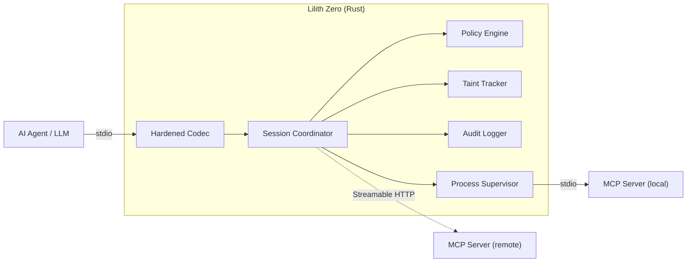

<div align="center">

# Lilith-Zero

**Deterministic Security Middleware for MCP tool calls written in Rust.**

<br/>

[](https://github.com/BadC-mpany/lilith-zero/actions)
[](LICENSE)
[](https://github.com/BadC-mpany/lilith-zero/releases)

<br/>


<br/>


</div>

Lilith Zero is a high-performance security runtime that mitigates data exfiltration and unauthorized tool invocation in LLM-based agent systems. It interposes at the transport layer, enforcing security invariants through deterministic policy evaluation and strictly framed execution.

OS, framework, and language agnostic: uniform security primitives across all implementation environments.

---

## Technical Fundamentals

- **Fail-Closed Architecture**: defaults to `DENY`. Missing policy, parse error, or internal fault → all traffic blocked.
- **Zero-Trust Transport**: stdio and network payloads treated as potentially malicious; strict `Content-Length` framing prevents JSON smuggling.
- **Type-Safe Invariants**: Rust type system makes invalid security states (e.g. unverified taint propagation) unrepresentable at compile time.
- **Deterministic Classification**: tool classes are declared explicitly in policy; no runtime heuristics.

---

## Core Capabilities

| Capability | Implementation |
| :--- | :--- |
| **Deterministic ACLs** | Static allow/deny mapping for tool names and resource URIs. |
| **Dynamic Taint Tracking** | Session-bound sensitivity tags with explicit tool-class declarations. |
| **Lethal Trifecta Protection** | Auto-blocks the "Access Private → Access Untrusted → Exfiltrate" pattern. |
| **Tamper-Proof Audit Logs** | HMAC-SHA256 signed JSONL for non-repudiation. |
| **Logic-Based Policies** | Argument-level enforcement via recursive JsonLogic predicates. |
| **Zero-Copy Runtime** | <1 ms overhead via reference-based internal message passing. |
| **Process Supervision** | OS-level lifecycle management (`PR_SET_PDEATHSIG` / Job Objects / kqueue). |
| **Transport Hardening** | Content-Length framing; 10 MB body cap; 4 KB header cap. |
| **Distributed Tracing** | `lilith-telemetry` integration for cross-process span propagation and audit dashboards. |

---

## System Architecture


```mermaid
graph LR
    Agent["AI Agent / LLM"] -->|stdio| Codec

    subgraph lz["Lilith Zero &lpar;Rust&rpar;"]
        Codec["Hardened Codec"] --> Coord["Session Coordinator"]
        Coord --> Policy["Policy Engine"]
        Coord --> Taint["Taint Tracker"]
        Coord --> Audit["Audit Logger"]
        Coord --> Proc["Process Supervisor"]
    end

    Proc -->|stdio| ToolLocal["MCP Server &lpar;local&rpar;"]
    Coord -.->|Streamable HTTP| ToolRemote["MCP Server &lpar;remote&rpar;"]
```

The agent always communicates with Lilith Zero over stdio: the transport setting only changes how Lilith Zero connects *upstream*: spawning a local child process (stdio mode) or acting as an HTTP client to a remote MCP server (Streamable HTTP mode). Policy enforcement, taint tracking, and audit logging apply in both cases.

### Components

| Component | Role |
| :--- | :--- |
| **Hardened Codec** | LSP `Content-Length` framing; drops oversized frames before parse |
| **Session Coordinator** | Tokio actor; owns session state, taint set, history, HMAC token |
| **Policy Engine** | Static ACL + ordered taint rules; JsonLogic argument predicates |
| **Taint Tracker** | `Tainted<T>` / `Clean<T>` phantom wrappers; only Policy Engine produces `Clean<T>` |
| **Process Supervisor** | Platform-native child binding prevents orphan MCP server processes |
| **Audit Logger** | HMAC-signed JSONL to stderr + optional file; every decision logged |

---

## Agent Integrations

All adapters share the same policy engine, taint tracker, and audit layer: only the I/O contract differs.

### Claude Code

**Step-by-step setup guide:** [`examples/claude-code/README.md`](examples/claude-code/README.md)  

Hooks fire on every (only `PreToolCall` is blocking) tool call. Lilith reads the JSON event from stdin and signals via exit code: `0` = allow, `2` = block.


**`.claude/settings.json`** (project) or `~/.claude/settings.json`:
```json
{
  "hooks": {
    "PreToolUse": [{"matcher": "", "hooks": [{"type": "command", "command": "lilith-zero hook --policy ~/policy.yaml"}]}]
  }
}
```
You can also use `PostToolUse` to only log each tool usage, it won't block the calls though.


**Ready-to-use policies:** [`examples/claude-code/policy-safe-default.yaml`](examples/claude-code/policy-safe-default.yaml) · [`examples/claude-code/policy-bash-enabled.yaml`](examples/claude-code/policy-bash-enabled.yaml)

### GitHub Copilot CLI

Copilot reads `{"permissionDecision":"allow"|"deny"}` from stdout; exit code is always `0`.

**`~/.config/github-copilot/hooks.json`**:
```json
{
  "preToolUse":  {"command": "lilith-zero hook --format copilot --event preToolUse --policy /path/to/policy.yaml"},
  "postToolUse": {"command": "lilith-zero hook --format copilot --event postToolUse --policy /path/to/policy.yaml"}
}
```

See `examples/gh-copilot/` for complete policy examples (`bash`, `view`, `rg`, `glob`, `report_intent`).

### VS Code Copilot Sidebar

Event type is inferred from the payload: no `--event` flag required.

**`.vscode/settings.json`**:
```json
{
  "github.copilot.chat.agent.hooks": {
    "PreToolUse":  {"command": "lilith-zero hook --format vscode --policy /path/to/policy.yaml"},
    "PostToolUse": {"command": "lilith-zero hook --format vscode --policy /path/to/policy.yaml"}
  }
}
```

See `examples/vscode/` (`editFiles`, `runTerminalCommand`, `#fetch`, `#codebase`, MCP tools).

### OpenClaw

OpenClaw uses stdio MCP only. Wrap each MCP server via `lilith-zero run` in `~/.openclaw/openclaw.json`:

```json
{
  "mcp": {
    "servers": {
      "filesystem": {
        "command": "lilith-zero",
        "args": ["run",
                 "--upstream-cmd", "npx -y @modelcontextprotocol/server-filesystem /home/user/projects",
                 "--policy", "~/.lilith/openclaw-policy.yaml"],
        "transport": "stdio",
        "env": {"LILITH_ZERO_PIN_FILE": "~/.lilith/pins/filesystem.json"}
      }
    }
  }
}
```

See `examples/openclaw/` for `policy-base.yaml` (conservative) and `policy-paranoid.yaml` (read-only).  
The `examples/openclaw/CVE-COVERAGE.md` maps all 139 OpenClaw advisories to the corresponding lilith-zero controls.

> **Forward-looking:** once OpenClaw ships its hook system ([#60943](https://github.com/openclaw/openclaw/issues/60943)), replace the `run` wrapper with:  
> `lilith-zero hook --format openclaw --policy ~/.lilith/openclaw-policy.yaml`

### Copilot Studio Webhook

REST server implementing the Microsoft Copilot Studio External Threat Detection API.

```bash
# Dev: no auth
lilith-zero serve --bind 127.0.0.1:8080 --auth-mode none --policy policy.yaml

# Production: Microsoft Entra ID (RS256)
lilith-zero serve --bind 0.0.0.0:8443 \
  --auth-mode entra \
  --entra-tenant-id <TENANT_GUID> \
  --entra-audience https://security.contoso.com \
  --policy policy.yaml
```

Endpoints: `POST /validate` (health), `POST /analyze-tool-execution` (policy evaluation).

### Session Persistence

Hook mode maintains taint state **across binary restarts** within a session. State is stored in `~/.lilith/sessions/<session-id>.json` under a cross-process file lock (`LockFileEx` on Windows, `flock` on Unix). Taints accumulated in one tool call are visible to the next invocation.

---

## Transports

### stdio (default)
```bash
lilith-zero run --upstream-cmd "python mcp_server.py" --policy policy.yaml
```
Wraps a child MCP server process. Lilith Zero sits between agent and server on stdin/stdout.

### Streamable HTTP (MCP 2025-11-25)
```bash
lilith-zero run --transport http --upstream-url http://localhost:9000/mcp --policy policy.yaml
```
Connects to a remote MCP server; no child process spawned.

---

## SDKs

### Python
```bash
uv add lilith-zero          # auto-downloads the correct binary for your platform
# or: pip install lilith-zero
```
```python
from lilith_zero import Lilith

async with Lilith("python mcp_server.py", policy="policy.yaml") as lz:
    result = await lz.call_tool("read_file", {"path": "/data/report.txt"})
```

### TypeScript / Node.js
```bash
bun add @badcompany/lilith-zero
# or: npm install @badcompany/lilith-zero
```
```typescript
import { Lilith } from "@badcompany/lilith-zero";

await using lz = new Lilith({ upstream: "bun mcp_server.ts", policy: "policy.yaml" });
const result = await lz.callTool("read_file", { path: "/data/report.txt" });
```

---

## Setup

### 1. Install

**Shell (Unix/macOS)**:
```bash
curl -sSfL https://www.badcompany.xyz/lilith-zero/install.sh | sh
```

Installs to `~/.local/bin/lilith-zero`. If your shell doesn't find it, add to `~/.zshrc` or `~/.bashrc`:
```bash
export PATH="$HOME/.local/bin:$PATH"
```

**PowerShell (Windows)**:
```powershell
irm https://badcompany.xyz/lilith-zero/install.ps1 | iex
```

**Python SDK** (manages the binary automatically):
```bash
pip install lilith-zero
# or: uv add lilith-zero
```

**From source** (requires Rust toolchain):
```bash
git clone https://github.com/BadC-mpany/lilith-zero.git
cd lilith-zero && cargo install --path lilith-zero
```

Verify: `lilith-zero --version`

### 2. Create a policy file

Save a policy YAML **before** wiring hooks — Lilith fails closed (blocks everything) if the policy file is missing or malformed.

**Tool names must match your agent's actual tool names.** For example, Claude Code uses `Read`, `Edit`, `Write`, `Bash` — not `read_file`, `bash`.

```yaml
id: my-policy
customer_id: my-org
name: "My Agent Policy"
version: 1

protect_lethal_trifecta: true

tool_classes:
  Read:      [ACCESS_PRIVATE]
  WebFetch:  [UNTRUSTED_SOURCE]
  WebSearch: [UNTRUSTED_SOURCE]
  Bash:      [EXFILTRATION]

static_rules:
  Read:   ALLOW
  Edit:   ALLOW
  Write:  ALLOW
  Bash:   DENY

taint_rules:
  - tool: Read
    action: ADD_TAINT
    tag: ACCESS_PRIVATE

  - tool: WebFetch
    action: ADD_TAINT
    tag: UNTRUSTED_SOURCE

resource_rules: []
```

`protect_lethal_trifecta: true` injects a rule that blocks any tool declared as `EXFILTRATION` class when both `ACCESS_PRIVATE` **and** `UNTRUSTED_SOURCE` taints are simultaneously active. Tool class assignments are always explicit in the policy: no name-based inference.

See [`examples/claude-code/`](examples/claude-code/) for complete Claude Code policies covering all tools.

### 3. Wire it to your agent

**Claude Code** — add to `~/.claude/settings.json` (global) or `.claude/settings.json` (per-project):

```json
{
  "hooks": {
    "PreToolUse": [
      {
        "matcher": "",
        "hooks": [
          {
            "type": "command",
            "command": "lilith-zero hook --policy ~/policy.yaml"
          }
        ]
      }
    ]
  }
}
```

For other agents, see the [Agent Integrations](#agent-integrations) section above.

### 4. Environment variables

| Variable | Description | Default |
| :--- | :--- | :--- |
| `LILITH_ZERO_FORCE_LETHAL_TRIFECTA` | Global override: enforces trifecta protection regardless of policy. | `false` |
| `LILITH_ZERO_SECURITY_LEVEL` | `audit_only` or `block_params`. | `block_params` |
| `LILITH_ZERO_JWT_SECRET` | HMAC secret for external audience token verification. |: |
| `LOG_LEVEL` | `debug` / `info` / `warn` / `error`. | `info` |

---

## Observability

### Audit Logs

Every decision: ALLOW and DENY: emits a tamper-evident JSONL line to stderr:

```
[AUDIT] <HMAC-SHA256-base64url> {"session_id":"…","timestamp":…,"event_type":"Decision","details":{"decision":"DENY","tool_name":"curl"}}
```

Verifying the signature against the session key proves the log was not altered after the fact.

### lilith-telemetry

`lilith-telemetry` is a companion sidecar that aggregates Lilith Zero security events into structured, distributed traces. It implements the `TelemetryHook` trait and routes spans through a configurable Flock dispatch pipeline.

```bash
# Run with telemetry enabled (Flock link from your dashboard)
lilith-zero-telemetry run \
  --upstream-cmd "python mcp_server.py" \
  --policy policy.yaml \
  --flock-link "lilith://collector:7700?key_id=0x<hex>"
```

Each tool call produces a parent span with child spans for codec framing, policy evaluation, and the upstream call. Decisions are tagged `LEVEL: ROUTINE` (allow) or `LEVEL: CRITICAL` (deny/violation):

```
SESSION: 189e9a3a…  TRACE: 189e9a44…  SPAN: 189e9a44…  LEVEL: CRITICAL  KIND: Server
MSG: Blocked tool web_search: Web search prohibited after database access (exfiltration prevention)
```

Multi-tool interactions from a single LLM reasoning step are grouped into unified trace spans, enabling precise audit of the full agent decision chain.

---

## Security & Assurance

| Layer | Implementation | Status |
| :--- | :--- | :--- |
| **Formal Verification** | Kani Rust Verifier proofs: taint sanitization, overflow safety, session entropy | **Verified** |
| **Fuzz Testing** | Cargo Fuzz: JSON-RPC codec and policy parser | **Active** |
| **Static Analysis** | Clippy `-D warnings` + Cargo Audit supply chain | **Passing** |
| **Red Teaming** | Python SDK hermetic test suite: prompt injection, payload malformation, policy bypass | **Passing** |
| **Type Safety** | Rust (memory safety) + `mypy --strict` (Python SDK) | **Enforced** |

[View full SECURITY.md](SECURITY.md) for proof harnesses and audit logs.

---

## Performance

**Micro-benchmarks (core logic):**
- Codec decoding: **~247 ns** / message
- Policy evaluation: **~660 ns** / rule

**End-to-end (Windows, release build, p50):**
- RPC overhead: **< 0.5 ms**
- Startup: **~15 ms** (process spawn + handshake)
- Memory: **~4 MB** RSS
- Throughput: **> 1.5 M** validations/sec

---

## Development

See **[docs/development.md](docs/development.md)** for full setup.

```bash
# Rust core (from lilith-zero/)
cargo build && cargo test --all-features
cargo clippy --all-targets --all-features -- -D warnings

# Python SDK (from sdk/)
uv venv && uv pip install -e ".[dev]" && uv run pytest tests -v
```

---

## License

Apache License, Version 2.0. See [LICENSE](LICENSE).
