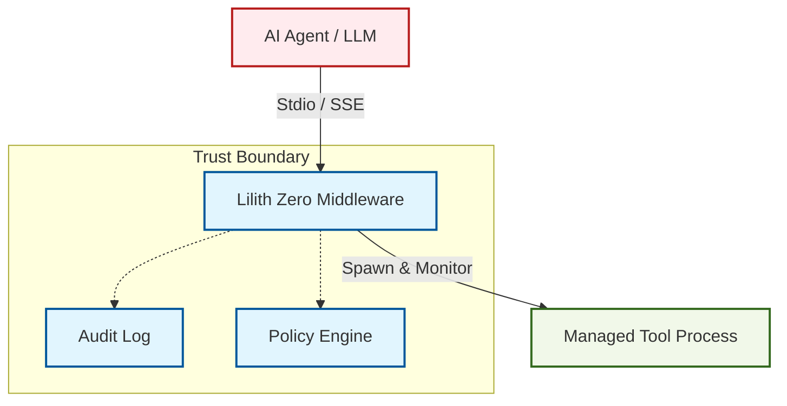

# Architecture

**Lilith Zero** acts as a **transparent security proxy** for the Model Context Protocol (MCP). It sits between your AI Agent (the "Client") and the MCP Tools (the "Server").

## High-Level Overview

The system is composed of three main layers:

1.  **The Agent (Untrusted Core)**: Your LLM-driven application (LangChain, AutoGen, etc.).
2.  **Lilith Zero (Trusted Middleware)**: The security boundary. It intercepts, audits, and supervises all traffic.
3.  **The Tools (Supervised Execution)**: External binaries (Python scripts, Bash commands) that execute actual work.

## Core Components

### 1. The Interceptor
Lilith Zero intercepts the `stdio` streams (stdin/stdout/stderr) of the MCP protocol. It parses every JSON-RPC message in real-time.

-   **Input Validation**: Checks if the JSON is malformed.
-   **Policy Check**: Consults the Policy Engine to see if the requested tool execution is allowed.
-   **Anonymization**: Redacts PII (Personally Identifiable Information) from logs before writing them to disk.

### 2. The Policy Engine
The Policy Engine is a deterministic state machine that enforces rules defined in `policy.yaml`.

-   **Allowlist/Blocklist**: Controls which tools can be executed.
-   **Argument Filtering**: Validates arguments against regex patterns (e.g., allow `ls` only on `/tmp`).
-   **Rate Limiting**: Prevents denial-of-service via tool flooding.

### 3. The Process Supervisor
Unlike standard MCP implementations that just `spawn` a process, Lilith Zero acts as a **Supervisor for Tools**.

-   **Zombie Protection**: Uses OS-specific primitives (Job Objects on Windows, `kqueue` on macOS, `PR_SET_PDEATHSIG` on Linux) to ensure child processes **always** die when the parent dies.
-   **Resource Limits**: Enforces CPU and Memory caps on tool processes.
-   **Lifecycle Management**: Wraps tools in platform-specific supervisors to ensure clean termination.
