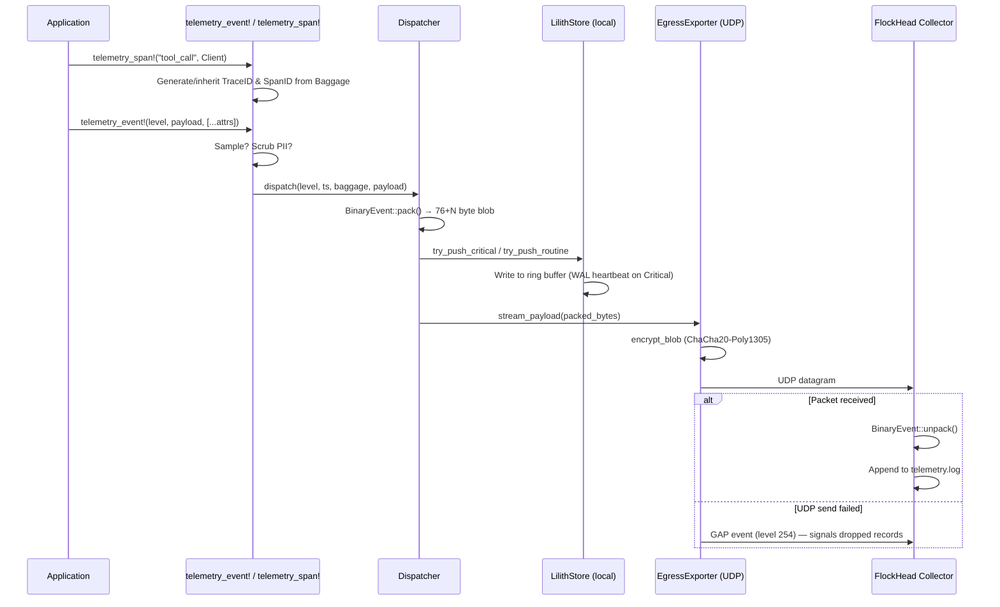

# Lilith Telemetry Framework

A high-performance, lock-free, encrypted telemetry subsystem designed as the kernel-level audit trail for Lilith-Zero deployments. Built for low-overhead data collection, deterministic event ordering, and massive scalability across multi-node ("flock") environments.

---

## Table of Contents

1. [Architecture Overview](#1-architecture-overview)
2. [Log Hierarchy](#2-log-hierarchy)
3. [Binary Wire Protocol](#3-binary-wire-protocol)
4. [Component Documentation](#4-component-documentation)
5. [Telemetry Flow](#5-telemetry-flow)
6. [Setup and Integration](#6-setup-and-integration)
7. [Trace Dashboard](#7-trace-dashboard)
8. [API Reference](#8-api-reference)
9. [Production Roadmap](#9-production-roadmap)
10. [Dependencies](#10-dependencies)

---

## 1. Architecture Overview

Lilith Telemetry follows a **Jaeger-inspired** architecture split into three distinct roles:

| Role | Equivalent | Description |
|---|---|---|
| `Alone` | Local Logger | No networking. Data stays on this machine only. |
| `FlockMember` | Jaeger Agent | Runs on each workstation. Bundles and streams traces to the FlockHead. |
| `FlockHead` | Jaeger Collector + UI | Central server. Receives, persists traces, and serves the Trace Dashboard. |

```
[Workstation A]  [Workstation B]  [Workstation C]
    Node            Node              Node
     │                │                │
     └────────────────┼────────────────┘
              UDP (ChaCha20-Poly1305)
                      │
                 [Server Machine]
                  FlockHead
                 ┌───────────┐
                 │ Collector │───» telemetry.json
                 └───────────┘         │
                 ┌───────────┐         ▼
                 │ Dashboard │───»  Browser
                 └───────────┘
          node_keys.db  ← key registry
          telemetry.log  ← audit trail
```

---

## 2. Log Hierarchy

Every telemetry event carries a **5-level contextual hierarchy**. From broadest to narrowest:

```
NODE (agent_id)
 └── SESSION (session_id)
      └── TRACE (trace_id)
           └── SPAN (span_id → parent_span_id)
                └── EVENT (payload + metadata)
```

### What Each Level Means

| Level | Type | Lifetime | Description |
|---|---|---|---|
| **Node** | `u64` (key ID) | Forever | Identifies the **workstation** by its Flock Key from `flock_keys.db`. Changes only when a new node is provisioned. |
| **Session** | `u128` | Process lifetime | Identifies a **single run** of the agent software. Generated once at startup. If the process restarts, a new session ID is generated. All events from one launch share the same session. |
| **Trace** | `u128` | Per task/action | Identifies a **single logical task** (e.g., "execute this tool call"). One session contains many traces. Events belonging to the same task share the same Trace ID. |
| **Span** | `u64` | Per operation | Identifies a **sub-operation within a task** (e.g., "lookup phase" inside a tool call). A trace contains one or more spans. Spans can be nested via the `parent_span_id`. |
| **Event** | bytes | Instant | The actual **log line**: a message + metadata (level, kind, policy, thread). |

### Example: What a Tool Call Looks Like in `telemetry.log`

When a node starts, one `SESSION_INIT` event is emitted immediately:
```
[13:10:00]  NODE: 0x189c5a0a5297f138  SESSION: a4b18d2e...  TRACE: f73c9e1a...  SPAN: 81ab...  PARENT: 0000...  LEVEL: SESSION_INIT  KIND: Internal  MSG: SESSION_INIT
```

When the node calls a tool (`tool list_dir /tmp`), **two events are emitted sharing the same Trace ID**, linked by CALL → RESULT:
```
[13:10:05]  NODE: 0x189c5a0a5297f138  SESSION: a4b18d2e...  TRACE: 5f21c9d3...  SPAN: 3a7d...  PARENT: 0000...  LEVEL: ROUTINE       KIND: Client    MSG: CALL tool: list_dir with args: /tmp
[13:10:05]  NODE: 0x189c5a0a5297f138  SESSION: a4b18d2e...  TRACE: 5f21c9d3...  SPAN: 7e9f...  PARENT: 3a7d...  LEVEL: ROUTINE       KIND: Client    MSG: RESULT tool: list_dir -> [success: /tmp, items: 42]
```

**Key observations:**
- `SESSION` is identical across all events (all from same process run).
- `NODE` is identical across all events (all from same workstation).
- `TRACE` is identical for CALL and RESULT, but **different** from the SESSION_INIT — they are separate logical tasks.
- `PARENT` of RESULT = `SPAN` of CALL — this creates the parent→child span tree for Jaeger-style visualization.

When a node is restarted, all subsequent events will have the **same NODE** but a **new SESSION**:
```
[13:11:00]  NODE: 0x189c5a0a5297f138  SESSION: b8c29e1f...  ...  LEVEL: SESSION_INIT  MSG: SESSION_INIT
```

---

## 3. Binary Wire Protocol

Every packet sent over UDP is a fully packed `BinaryEvent` (76-byte header + variable payload). This is the **canonical on-wire and on-disk format**.

```
Offset  Size  Field           Description
──────  ────  ──────────────  ─────────────────────────────────────────────
0       8     timestamp       CPU RDTSC cycle counter (hardware timestamp)
8       8     session_id_hi   Upper 64 bits of 128-bit Session ID
16      8     session_id_lo   Lower 64 bits of 128-bit Session ID
24      8     trace_id_hi     Upper 64 bits of 128-bit Trace ID
32      8     trace_id_lo     Lower 64 bits of 128-bit Trace ID
40      8     span_id         Current span identifier (64-bit)
48      8     parent_span_id  Parent span ID (0 = root span)
56      8     agent_id        Node's Flock Key ID (from flock_keys.db)
64      4     thread_id       Hardware thread ID
68      4     policy_id       Security policy rule ID that triggered this
72      1     kind            SpanKind: 0=Internal 1=Server 2=Client 3=Producer 4=Consumer
73      1     event_level     0=CriticalDeny 1=RoutineAllow 254=Gap 255=SessionInit
74      2     payload_len     Byte length of the following payload
76      N     payload         UTF-8 message or raw binary data (N = payload_len)
```

**Total minimum packet size: 76 bytes.**

In production, the entire packet is wrapped in a **ChaCha20-Poly1305** AEAD ciphertext before transmission (adds a 16-byte MAC tag). The FlockHead decrypts using the node's symmetric secret from `flock_keys.db`.

---

## 4. Component Documentation

### A. Instrumentation Layer (Frontend)

- **`macros.rs`** — `telemetry_event!` and `telemetry_span!` macros. Zero-cost when feature `disable_telemetry` is enabled. Pull context from thread-local `Baggage`, scrub PII, sample, and dispatch.
- **`baggage.rs`** — Context propagation system. Carries `SessionId`, `TraceId`, `SpanId`, `SpanKind`, `agent_id`, and security metadata through async boundaries using thread-local storage. `SpanGuard` automatically restores previous context on scope exit.
- **`sampling.rs`** — Adaptive sampler. `CriticalDeny` events: 100% sampled. `RoutineAllow` events: ~1% sampled via xorshift64 over RDTSC (uniform, allocation-free).
- **`scrubber.rs`** — PII redaction stub. In production: Hyperscan/regex FSM scanning for JWTs, Bearer tokens, PII patterns before data reaches any serialization boundary.
- **`clock.rs`** — Hardware timestamps via `RDTSC`. Falls back to `SystemTime` on non-x86_64. Includes NTP drift recalibration for clock correlation across distributed nodes.

### B. Core Dispatcher

- **`dispatcher.rs`** — Lock-free event router. Constructs `BinaryEvent`, calls `pack()`, writes to local store and streams to egress in one pass.
  - **Fast Path** (`CriticalDeny`): Synchronous store write → immediate network egress.
  - **Slow Path** (`RoutineAllow`): Ring buffer insertion → batched egress.
  - **Session Init** (`SESSION_INIT`): Special level 255 event emitted at startup, not going through the sampling filter.

### C. Storage Engine

- **`storage.rs`** (`LilithStore`) — Binary event serializer and local ring buffer. `BinaryEvent::pack()` produces the 76 + N byte canonical format. `BinaryEvent::unpack()` is the inverse, returning the header and payload. `try_push_critical` writes to the fast buffer with a WAL heartbeat. `try_push_routine` uses relaxed atomics.

### D. Egress Exporter

- **`exporter.rs`** (`EgressExporter`) — Non-blocking UDP sender. Encrypts the packed `BinaryEvent` and streams it to the FlockHead. On failure, emits a signed `GAP` event (level 254) so the server knows data was lost rather than never sent.
- **`crypto.rs`** (`EphemeralSession`) — Key derivation and AEAD wrapper. Currently a passthrough stub; see [Production Roadmap](#8-production-roadmap).

### E. Network / Discovery

- **`api.rs`** (`KeyRegistry`, `spawn_ingester`) — Key management and FlockHead listener. `KeyRegistry` persists node credentials to `flock_keys.db`. `spawn_ingester` runs a blocking UDP recv loop in a background thread, unpacks events, writes to `telemetry.log`.
- **`discovery.rs`** (`FlockLink`) — Parses and generates `lilith://host:port?key_id=0x…` URIs.

---

## 5. Telemetry Flow



---

## 6. Setup and Integration

### Prerequisites

```bash
git clone <repo>
cd lilith-telemetry
cargo build
```

---

### Option A — Standalone Mode (`Alone`)

No networking. All telemetry is stored locally on this machine.

```rust
use lilith-telemetry::{init, DeploymentMode};
init(DeploymentMode::Alone);
```

**Where is data stored?**
In the in-process `LilithStore` ring buffer (RAM). In a fully implemented deployment this flushes to local immutable SSTables on disk.

---

### Option B — Flock Cluster (Multi-Node → Central Collector)

This is the standard production setup. Follow these four steps in order.

---

#### Step 1 — Start the FlockHead (Central Server)

Run this on the **server machine**. It will create `flock_keys.db` and `telemetry.log` if they don't exist.

```bash
cargo run --example server
```

Expected output:
```
--- Lilith Telemetry [FlockHead / Collector] ---
Loaded 0 authorized node(s) from 'flock_keys.db'
Collector online at UDP 127.0.0.1:44317. Press Ctrl+C to stop.

Lilith-Telemetry [FlockHead]: Ready. Waiting for agent traces...
```

**Where is data stored on the FlockHead?**
- `flock_keys.db` — node credentials (Key ID, secret, connection link)
- `telemetry.log` — all received events from all nodes, in human-readable format

---

#### Step 2 — Provision a New Node

For each workstation you want to monitor, run this on the **server** to generate a unique key and connection link:

```bash
cargo run --example provision -- new
```

Output:
```
Provisioned new node:
  Key ID : 0x189c5a0a5297f138
  Link   : lilith://127.0.0.1:44317?key_id=0x189c5a0a5297f138

Send this link to the new workstation.
```

The `flock_keys.db` file stores three columns per node:

| Column    | Description                            |
|-----------|----------------------------------------|
| `key_id`  | Hex identifier for this node           |
| `secret`  | 256-bit symmetric encryption key (hex) |
| `link`    | The `lilith://` URI issued to the node |

To list all currently provisioned nodes:
```bash
cargo run --example provision
```

---

#### Step 3 — Start the Node (FlockMember)

> [!IMPORTANT]
> The **FlockHead (server)** must be running **before** you start the node or events will be dropped.

On the **workstation**, use the link from Step 2:

```bash
cargo run --example client -- "lilith://127.0.0.1:44317?key_id=0x189c5a0a5297f138"
```

The client will immediately send a `SESSION_INIT` event to the FlockHead, then wait for your input:
```
--- Lilith Telemetry Node (FlockMember) ---
Connecting to FlockHead at 127.0.0.1:44317
Device Key ID: 0x189c5a0a5297f138
Telemetry initialized. Enter messages to send as events (or 'exit' to quit):
```

You can send:
- **Plain text**: `hey` → emits a `CriticalDeny` event
- **Tool simulation**: `tool <name> <args>` → emits a CALL + RESULT pair sharing the same Trace ID
- **Exit**: `exit`

**Where is data stored on the FlockMember?**
Events are buffered in the local in-process ring buffer (RAM) and immediately streamed over UDP to the FlockHead. The FlockMember does **not** write a persistent log itself — the FlockHead is the single source of truth.

---

#### Step 4 — Monitor the Audit Trail

On the **server**, watch the live log:

```bash
tail -f telemetry.log
```

You will see structured lines like:
```
[2026-03-13 13:10:00]  NODE: 0x189c5a0a5297f138  SESSION: a4b18d2e...  TRACE: f73c9e1a...  SPAN: 81ab...  PARENT: 0000...  LEVEL: SESSION_INIT  KIND: Internal  MSG: SESSION_INIT
[2026-03-13 13:10:05]  NODE: 0x189c5a0a5297f138  SESSION: a4b18d2e...  TRACE: 5f21c9d3...  SPAN: 3a7d...  PARENT: 0000...  LEVEL: CRITICAL      KIND: Client    MSG: hey
[2026-03-13 13:10:10]  NODE: 0x189c5a0a5297f138  SESSION: a4b18d2e...  TRACE: 7b91e4c2...  SPAN: 3a7d...  PARENT: 0000...  LEVEL: ROUTINE       KIND: Client    MSG: CALL tool: list_dir with args: /tmp
[2026-03-13 13:10:10]  NODE: 0x189c5a0a5297f138  SESSION: a4b18d2e...  TRACE: 7b91e4c2...  SPAN: 7e9f...  PARENT: 3a7d...  LEVEL: ROUTINE       KIND: Client    MSG: RESULT tool: list_dir -> [success: /tmp, items: 42]
```

---

#### Step 5 — Start the Trace Dashboard (Visualizer)

The dashboard provides a Jaeger-like visual timeline (Gantt chart) of your spans.

1. **Start the Dashboard Server**:
   ```bash
   cd dashboard
   # Ensure your environment is active
   python app.py
   ```

2. **Open the browser**:
   Navigate to [http://127.0.0.1:16617](http://127.0.0.1:16617)

The dashboard automatically reads `telemetry.json` from the collector and displays a live, hierarchical view of your agent's decision traces.

---

#### Step 6 — Code Integration (Your Own Rust App)

```rust
use lilith-telemetry::{init, DeploymentMode, FlockLink};
use lilith-telemetry::crypto::KeyHandle;
use lilith-telemetry::{telemetry_event, telemetry_span, dispatcher::EventLevel, SpanKind};

// Parse the provisioned link (from env, config file, or hardcoded for tests)
let link = FlockLink::parse("lilith://127.0.0.1:44317?key_id=0x189c5a...")
    .expect("Invalid connection link");

// Initialize once at startup — emits SESSION_INIT automatically
init(DeploymentMode::FlockMember {
    target_api_endpoint: format!("{}:{}", link.host, link.port),
    auth_key: KeyHandle(link.key_id),
});

// Instrument any block with a span
{
    let _span = telemetry_span!("policy_eval", SpanKind::Server);

    telemetry_event!(
        EventLevel::CriticalDeny,
        b"Blocked unauthorized syscall",
        ["user" => "root", "severity" => "critical"]
    );
} // Previous context restored automatically here
```

---

## 7. API Reference

### `init(mode: DeploymentMode)`
Initialize the telemetry subsystem. Must be called exactly once at process startup.
- For `FlockMember`: generates `SessionId`, emits `SESSION_INIT`, sets `agent_id` (from key).
- For `FlockHead`: starts the background UDP listener thread.

### `telemetry_span!(name, SpanKind) → SpanGuard`
Opens a new span scope. Generates a fresh `TraceId` if none is active. Restores previous context when the guard drops.

### `telemetry_event!(EventLevel, payload [, [key => val, ...]])`
Emits a single event. Applies PII scrubbing and adaptive sampling. Dispatches to local store and network egress.

### `KeyRegistry::provision_node() → (KeyHandle, link_str)`
Generates a new `key_id`, 256-bit secret, and `lilith://` URI atomically. Persists to `flock_keys.db` immediately.

### `FlockLink::parse(s) → Result<FlockLink, _>`
Parses a `lilith://host:port?key_id=0x…` URI into a typed struct.

---

## 8. Production Roadmap

The following components are **stubs** and must be implemented before production deployment:

| Component | Status | Next Step |
|---|---|---|
| `crypto.rs` — `encrypt_blob` | **Stub (passthrough)** | Implement ChaCha20-Poly1305 AEAD using `chacha20poly1305` crate |
| `crypto.rs` — `EphemeralSession::new` | **Stub** | Derive session key from node secret via HKDF |
| `api.rs` — ingester auth | **Not enforced** | Verify ChaCha20 MAC tag; reject packets with invalid agent key |
| `storage.rs` — disk persistence | **In-RAM only** | Implement mmap'd SSTable flush to disk |
| `storage.rs` — WAL heartbeat | **No-op** | Write binary header to a WAL file on critical events |
| `scrubber.rs` — PII scrubbing | **No-op** | Implement Hyperscan/regex FSM for credential patterns |
| `api.rs` — secret generation | **RDTSC stub** | Replace with `OsRng` from the `rand` crate |
| OTLP Bridge | **TBD** | Translate `BinaryEvent` to OpenTelemetry OTLP Protobufs for `FlockHead` Exporter |

> [!CAUTION]
> The current `encrypt_blob` is a **passthrough**. All telemetry data is transmitted **in plaintext** until ChaCha20-Poly1305 is implemented. Do not deploy in a production environment with sensitive data.

---

## 9. Jaeger (OTLP) Integration Strategy

To unlock standard observability platforms (Jaeger, Grafana Tempo, Datadog), Lilith Telemetry is designed to act as an OTLP (OpenTelemetry Protocol) gateway at the `FlockHead` level.

### Conversion Pipeline

The `FlockHead` will implement a gRPC or HTTP/Protobuf exporter that translates the raw `BinaryEvent` stream into OTLP Spans.

**Mapping `BinaryEvent` to `opentelemetry_proto::trace::v1::Span`:**

1.  **Trace ID & Span ID:**
    *   `trace_id_hi` + `trace_id_lo` → 16-byte OTLP `trace_id`.
    *   `span_id` → 8-byte OTLP `span_id`.
    *   `parent_span_id` → 8-byte OTLP `parent_span_id`.
2.  **Timestamps:**
    *   `timestamp` (RDTSC) → Must be calibrated against the `FlockHead`'s wall-clock time upon node connection to generate accurate UNIX EPOCH nanoseconds for `start_time_unix_nano`.
3.  **Attributes:**
    *   `agent_id` → `node.id` attribute (identifies the workstation).
    *   `session_id_hi/lo` → `process.session.id` attribute.
    *   `policy_id` → `security.policy.triggered` attribute.
4.  **Events:**
    *   `payload` + `event_level` → Mapped as a `Span::Event` containing the log message and severity level, attached directly to the active span.

By performing this translation on the central `FlockHead` server, the edge `FlockMember` nodes remain extremely lightweight, requiring no heavy Protobuf or gRPC dependencies.

---

## 9. Dependencies

```toml
[dependencies]
hex    = "0.4"    # Key serialization for flock_keys.db
chrono = "0.4"    # Timestamps in telemetry.log

# Planned production dependencies:
# chacha20poly1305 = "0.10"  # AEAD encryption
# rand             = "0.8"   # CSPRNG for key and session ID generation
# crossbeam-queue  = "0.3"   # Lock-free ring buffer primitives
# hkdf             = "0.12"  # Session key derivation from node secret
```

```
uv pip install flask flask-cors
```